# 外贸聚合产品系统需求文档

版本：v1.0  
日期：2026-05-25  
阶段：MVP 内部使用，预留 SaaS 多租户扩展

## 1. 项目背景

外贸业务中，客户通常需要先浏览产品、选择规格、估算运输方式，再提交询价。业务人员随后需要在后台查看询价、管理客户、维护产品、供应商、加价规则，并持续跟进报价转化。

本系统定位为外贸聚合产品平台，前台面向海外客户展示产品并承接询价，后台面向内部业务团队管理产品、报价单、客户、供应商及跟进记录。MVP 阶段优先完成业务闭环，保证内部可以真实使用；后续再演进为可对外推广的 SaaS 多租户系统。

## 2. 项目目标

### 2.1 MVP 目标

- 支持内部团队维护产品、分类、规格、供应商、加价规则。
- 支持海外客户在前台浏览产品、选择规格、填写目的港并提交询价。
- 支持系统根据客户 IP 自动识别国家或地区，并允许客户手动修改。
- 支持后台自动接收前台询价，形成报价单记录。
- 支持业务人员维护客户资料、跟进记录和供应商资料。
- 支持基础仪表盘，帮助内部快速查看关键业务数据。
- 尝试实现产品采集、分析、报价换算、多语言、自动触达等差异化能力的最小可用版本。
- 技术实现以快速上线为优先，同时保留后续扩展空间。

### 2.2 SaaS 阶段目标

- 支持多租户，每个企业拥有独立数据、配置、品牌信息和前台站点。
- 支持更高并发、权限分层、审计日志、数据隔离和可观测性。
- 支持产品采集、数据分析、报价换算、汇率管理等增强能力。
- 支持企业级部署、计费、套餐、成员管理和租户级配置。

## 3. 用户角色

| 角色 | 使用端 | 主要目标 |
| --- | --- | --- |
| 海外客户 | 前台 | 浏览产品、选择规格、填写海运信息、提交询价 |
| 业务员 | 后台 | 查看报价单、维护客户、记录跟进、处理询价 |
| 产品运营 | 后台 | 维护产品分类、产品列表、规格、图片、加价规则 |
| 管理员 | 后台 | 管理公司资料、联系方式、资质证书、品牌信息、社交媒体配置 |
| SaaS 租户管理员 | 后台，二期 | 管理企业空间、成员、权限、品牌、套餐和站点配置 |
| 平台超级管理员 | 管理后台，二期 | 管理租户、套餐、平台配置、运营数据和异常处理 |

## 4. 产品范围

### 4.1 MVP 必做范围

后台：

- 登录
- 仪表盘
- 产品分类
- 产品列表
- 加价管理
- 报价单管理
- 客户管理
- 跟进记录
- 供应商管理
- 系统设置：公司资料、联系方式、资质证书、品牌信息、社交媒体

前台：

- 首页产品展示
- 全部产品列表
- 产品分类列表
- 产品详情与规格选择
- 集装箱或海运信息填写
- 获取海运报价
- 提交询价
- 自动生成后台报价单

基础能力：

- 国家或地区 IP 自动识别
- 询价表单校验
- 产品上下架
- 图片管理
- 基础搜索、筛选、分页

### 4.2 MVP 尝试实现或预留给二期

以下能力是产品差异化核心，不应被视为普通附加需求。MVP 阶段的策略是：优先打通最小闭环，复杂能力先采用半自动、人工确认、配置化或埋点预留的方式实现；当业务流程验证后，再在二期升级为自动化、规模化和可配置的 SaaS 能力。

- 产品采集
- 1688 源管理
- 分析管理：产品浏览分析、询盘分析、国家或地区分析、客户行为分析
- 报价换算
- 汇率管理自动化
- 多语言自动翻译
- 在线支付
- 客户前台账号体系
- 邮件、WhatsApp、CRM 深度集成

MVP 分层原则：

| 能力 | MVP 尝试版本 | 二期增强版本 |
| --- | --- | --- |
| 产品采集 | 支持导入已下载的网站离线包，解析 HTML/MHTML/Excel/JSON/图片资源并生成产品草稿 | 批量离线包导入、定时处理已下载文件、图片和规格自动清洗；长期探索全自动采集与注入 |
| 1688 源管理 | 保存源链接、源价格、供应商、下载批次、解析状态和原始文件引用 | 多源比价、供应商评分、价格变动提醒 |
| 分析管理 | 先做关键埋点和基础统计看板 | 完整行为分析、转化漏斗、客户画像、产品热度排行 |
| 报价换算 | 后台提供人工可编辑的报价计算器 | 自动计算产品价、加价、汇率、运费、税费和利润 |
| 汇率管理自动化 | 支持手动汇率和默认币种 | 汇率 API、历史汇率、生效时间和自动更新 |
| 多语言自动翻译 | 商品名称和描述支持人工维护多语言，预留自动翻译入口 | 接入翻译 API，批量翻译，人工审核发布 |
| 在线支付 | 先记录付款状态或外部付款链接 | Stripe、PayPal 等在线支付和订单闭环 |
| 客户前台账号体系 | MVP 可不强制注册，但预留客户识别和询价历史 | 客户登录、询价历史、收藏、订单和支付记录 |
| 邮件、WhatsApp、CRM 深度集成 | 先做邮件通知和 WhatsApp 跳转联系 | 自动邮件模板、WhatsApp API、CRM 双向同步 |

### 4.3 二期 SaaS 范围

- 多租户架构
- 租户独立前台站点
- 成员与角色权限
- 套餐与计费
- 数据隔离与审计日志
- 租户级品牌、域名、邮件模板配置
- 数据报表和分析
- API 和 Webhook

## 5. 核心业务流程

### 5.1 前台询价流程

1. 客户进入前台首页。
2. 客户浏览产品或进入全部产品列表。
3. 客户通过分类筛选产品。
4. 客户进入产品详情页。
5. 客户选择产品规格、数量等信息。
6. 客户进入集装箱或海运报价界面。
7. 系统根据 IP 自动识别客户国家或地区。
8. 客户填写或修改目的国家、目的港、运输相关信息。
9. 客户点击获取海运报价。
10. 系统展示海运报价或报价占位结果。
11. 客户点击提交询价。
12. 客户填写姓名、邮箱、电话、公司名、备注等联系方式。
13. 系统提交询价并生成后台报价单。
14. 后台报价单管理出现新询价记录。

### 5.2 后台处理询价流程

1. 业务员登录后台。
2. 业务员在报价单管理中查看新询价。
3. 业务员进入报价单详情查看客户、产品、规格、数量、目的港和备注。
4. 业务员可将客户信息沉淀到客户管理。
5. 业务员添加跟进记录。
6. 业务员根据供应商、加价规则和人工判断处理报价。
7. 报价单状态更新为已查看、跟进中、已报价、已成交或已关闭。

### 5.3 产品维护流程

1. 产品运营创建产品分类。
2. 产品运营创建产品并绑定分类。
3. 产品运营维护产品图片、名称、描述、规格、价格、供应商等信息。
4. 产品运营设置产品状态为上架或下架。
5. 前台仅展示上架产品。
6. 当价格策略变化时，产品运营维护加价规则。

### 5.4 离线产品注入流程

为降低实时爬虫风险，MVP 的产品上架注入不采用系统直接爬取第三方网站的方式，而采用“人工下载网站内容 -> 系统离线解析 -> 人工确认入库”的半自动流程。

1. 运营人员在外部环境中人工下载目标网站内容。
2. 下载内容形成离线导出包，包含 HTML/MHTML、Excel、JSON、图片资源等文件。
3. 运营人员在后台上传离线导出包，或将导出包放入系统指定目录。
4. 系统读取导出包并生成导入批次。
5. 系统解析商品分类、商品标题、价格、主图、SKU、颜色、源链接、产品详情和图片资源。
6. 系统根据去重规则合并重复商品或重复图片。
7. 系统生成产品草稿和解析报告。
8. 运营人员检查草稿内容、图片、分类、价格、规格和供应商来源。
9. 运营人员确认后，将产品草稿批量或单个注入正式产品库。
10. 正式产品保留来源文件、源链接、导入批次和解析日志，方便后续追溯。

开发样例：

- 当前仓库 `misc/export` 目录包含一份已下载并整理的样例导出包。
- 样例包含 `catalog_data.json`、SKU 明细 Excel、HTML 商城文件、原始图片目录和优化图片目录。
- 开发产品导入能力时，可优先使用该样例包作为解析、字段映射、图片入库和去重逻辑的测试数据。

## 6. 参考界面清单

本章节列出当前 PRD 已引用的参考界面，具体图片已放在对应功能章节中。

后台参考界面：

| 界面 | 文件 |
| --- | --- |
| 后台登录 | `docs/assets/admin-login.png` |
| 仪表盘 | `docs/assets/admin-dashboard.png` |
| 产品分类 | `docs/assets/admin-product-category.png` |
| 产品列表 | `docs/assets/admin-product-list.png` |
| 加价管理 | `docs/assets/admin-markup-management.png` |
| 报价单列表 | `docs/assets/admin-quote-list.png` |
| 报价单详情 | `docs/assets/admin-quote-detail.png` |
| 客户管理 | `docs/assets/admin-customer-management.png` |
| 跟进记录 | `docs/assets/admin-follow-up-records.png` |
| 供应商管理 | `docs/assets/admin-supplier-management.png` |

前台参考界面：

| 界面 | 文件 |
| --- | --- |
| 首页 | `docs/assets/frontend-home.png` |
| 全部产品 | `docs/assets/frontend-all-products.png` |
| 分类产品 | `docs/assets/frontend-category-products.png` |
| 规格选择 | `docs/assets/frontend-product-spec-modal.png` |
| 集装箱计算 | `docs/assets/frontend-container-calculator.png` |
| 获取海运报价 | `docs/assets/frontend-shipping-quote-modal.png` |
| 提交询价 | `docs/assets/frontend-submit-inquiry-modal.png` |
| 询价成功与 WhatsApp 联系 | `docs/assets/frontend-inquiry-success-whatsapp.png` |

## 7. 功能需求

### 7.1 后台登录

参考界面：

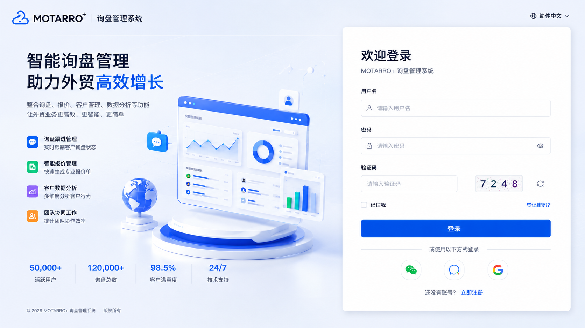

功能说明：

- 后台用户通过账号和密码登录。
- 登录成功后进入后台仪表盘。
- 未登录用户访问后台页面时跳转到登录页。

字段要求：

| 字段 | 必填 | 说明 |
| --- | --- | --- |
| 账号 | 是 | 可使用邮箱、手机号或用户名，MVP 可先使用邮箱 |
| 密码 | 是 | 密码输入框需隐藏明文 |

验收标准：

- 输入正确账号密码可登录。
- 输入错误账号或密码时展示错误提示。
- 登录态过期后需要重新登录。
- 后台页面必须鉴权访问。

### 7.2 后台仪表盘

参考界面：

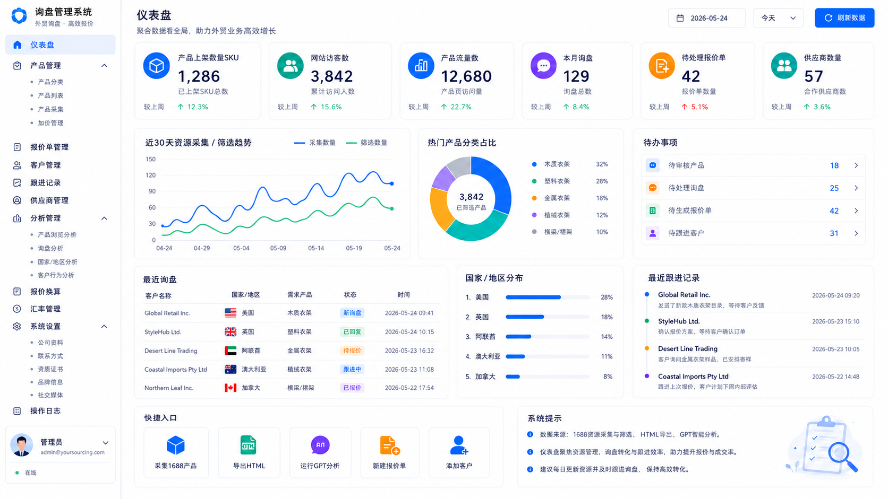

功能说明：

- 展示核心业务数据概览。
- 支持以卡片、图表、待办事项和最近记录的方式展示业务全局。
- 快捷入口和系统提示为可选能力，MVP 可根据开发排期决定是否实现。

MVP 指标：

| 指标 | 说明 |
| --- | --- |
| 产品总数 | 当前后台产品数量 |
| 上架产品数 | 当前前台可见产品数量 |
| 报价单总数 | 历史询价或报价单数量 |
| 今日新增询价 | 当日新增报价单数量 |
| 客户总数 | 已沉淀客户数量 |
| 待跟进数量 | 状态为新询价或跟进中的报价单数量 |
| 产品浏览量 | 前台产品详情浏览次数 |
| 供应商数量 | 已维护供应商数量 |

验收标准：

- 仪表盘数据与后台真实数据一致。
- 支持根据用户权限展示可见数据。
- 关键指标卡片支持点击跳转到对应管理页面，MVP 可选。

### 7.3 产品分类

参考界面：

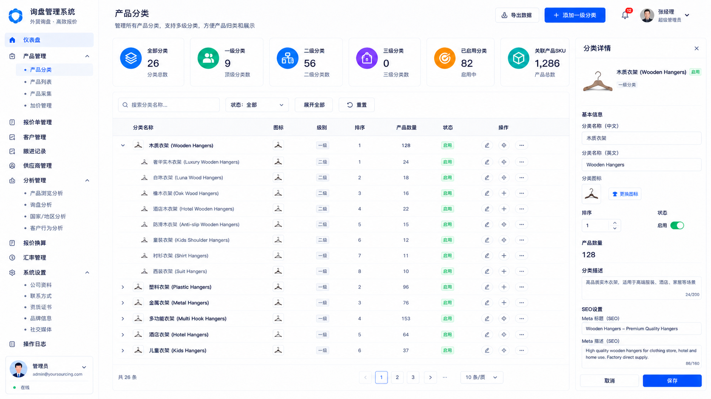

功能说明：

- 管理产品分类，用于前台分类导航和后台产品归类。

功能点：

- 新增分类
- 编辑分类
- 删除分类
- 分类启用或停用
- 分类排序
- 分类图片或图标，MVP 可选
- 父子级分类，MVP 建议支持一级分类，预留二级分类
- 分类详情侧栏，支持快速编辑基础信息、SEO 信息和启用状态，MVP 可选

字段要求：

| 字段 | 必填 | 说明 |
| --- | --- | --- |
| 分类名称 | 是 | 后台和前台展示名称 |
| 英文名称 | 是 | 前台面向海外客户展示 |
| 父级分类 | 否 | MVP 可为空 |
| 排序 | 否 | 数值越小越靠前 |
| 状态 | 是 | 启用、停用 |
| 分类图片 | 否 | 用于前台展示 |
| SEO 标题 | 否 | 用于前台分类页 SEO |
| SEO 描述 | 否 | 用于前台分类页 SEO |

验收标准：

- 停用分类不在前台展示。
- 删除分类前需检查是否存在关联产品。
- 前台分类列表按排序展示。

### 7.4 产品列表

参考界面：

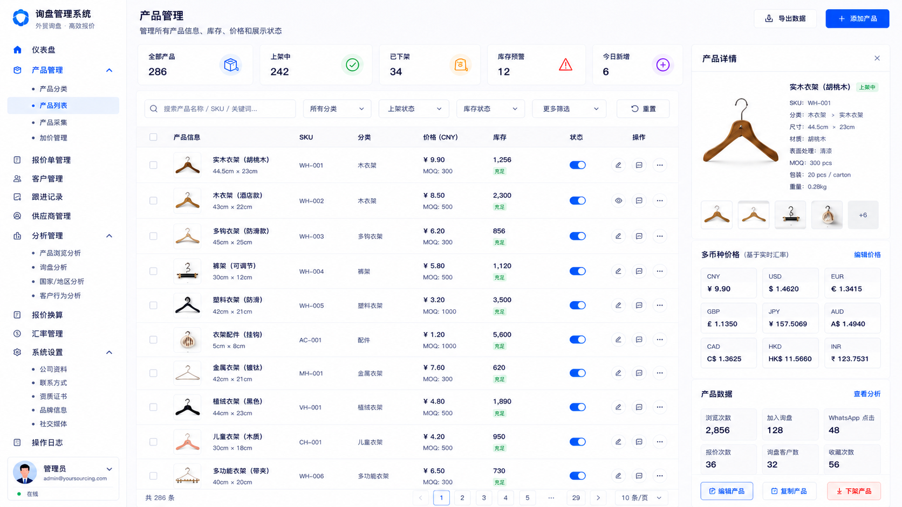

功能说明：

- 管理平台产品信息，作为前台展示和询价的基础数据。

功能点：

- 新增产品
- 编辑产品
- 删除或软删除产品
- 上架或下架产品
- 产品搜索
- 按分类筛选
- 图片上传与管理
- 规格维护
- 供应商关联
- 价格信息维护
- 库存或 MOQ 维护，MVP 可作为普通字段
- 产品详情侧栏，展示图片、规格、价格、库存、数据表现和快捷操作
- 导出产品数据，MVP 可选

核心字段：

| 字段 | 必填 | 说明 |
| --- | --- | --- |
| 产品名称 | 是 | 后台名称 |
| 英文名称 | 是 | 前台展示名称 |
| 产品分类 | 是 | 关联分类 |
| 产品主图 | 是 | 前台卡片和详情页展示 |
| 产品相册 | 否 | 详情页展示 |
| 产品描述 | 否 | 支持富文本或 Markdown |
| 规格 | 是 | 规格名、规格值、价格或备注 |
| 基础价格 | 否 | 可用于加价计算 |
| MOQ | 否 | 最小起订量 |
| 供应商 | 否 | 关联供应商 |
| 状态 | 是 | 上架、下架 |
| 排序 | 否 | 前台展示排序 |

验收标准：

- 上架产品可在前台展示。
- 下架产品不可在前台被普通客户访问。
- 产品详情页展示主图、相册、名称、分类、描述和规格。
- 产品列表支持分页、搜索和分类筛选。
- 后台点击产品可在列表右侧或详情页查看产品基础信息和数据表现。

### 7.5 产品采集与 1688 源管理

功能说明：

- 产品采集和 1688 源管理是提升选品和上架效率的关键差异化能力。
- 为避免实时爬虫风险，MVP 必须采用离线导入方案：先由人工下载目标网站内容，再由系统解析离线包并生成产品草稿。
- MVP 不要求系统直接访问第三方网站，也不要求全自动采集；重点是完成“离线包导入、内容解析、去重清洗、草稿生成、人工确认入库”的闭环。
- 产品长期目标仍然是尽可能自动化地完成“来源发现、内容获取、解析清洗、产品注入、持续更新”，但是否能做到全自动，需要在技术可行性、合规风险、平台规则、稳定性和成本上持续探索。

MVP 必做版本：

- 支持上传或选择离线导出包。
- 支持识别导出包中的 HTML、MHTML、Excel、JSON、图片目录等资源。
- 支持解析商品分类、商品标题、外贸批发价、主图、颜色 SKU 图组、可选颜色、1688 链接和产品详情。
- 支持读取解析报告，包括分类汇总、源页面数量、去重数量、异常状态和失败原因。
- 支持按分类、SKU 主体、颜色、标题、图片 hash 等规则进行去重。
- 支持将采集结果保存为草稿产品。
- 支持人工编辑草稿后发布为正式产品。
- 支持正式产品追溯来源链接、来源文件、导入批次和解析日志。
- 支持导入状态管理：待解析、解析中、已生成草稿、部分失败、已入库、已忽略。

样例数据：

| 文件或目录 | 说明 |
| --- | --- |
| `misc/export/catalog_data.json` | 分类汇总、去重规则、源页面状态和解析元数据 |
| `misc/export/1688衣架SKU明细_无待核无错图去重版.xlsx` | SKU 明细表，可用于字段映射和批量导入测试 |
| `misc/export/1688衣架独立站商城_无待核无错图去重版.html` | 已生成的静态商城 HTML，可用于前台展示结构参考 |
| `misc/export/assets/` | 原始图片资源目录 |
| `misc/export/assets_optimized/` | 优化后的图片资源目录 |

字段要求：

| 字段 | 必填 | 说明 |
| --- | --- | --- |
| 导入批次号 | 是 | 系统生成，用于追溯本次离线导入 |
| 导入包名称 | 是 | 上传文件名或目录名 |
| 导入包路径 | 否 | 服务器内部路径或对象存储路径 |
| 源平台 | 是 | MVP 默认 1688 或手动选择 |
| 源文件类型 | 是 | HTML、MHTML、Excel、JSON、图片目录等 |
| 源链接 | 否 | 1688 商品链接或来源页面链接 |
| 源商品名称 | 否 | 从离线包解析或人工录入 |
| 源价格 | 否 | 从离线包解析，用于报价参考 |
| 源图片 | 否 | 本地图片路径、对象存储路径或图片 URL |
| 源规格 | 否 | 规格文本或结构化 SKU |
| 关联供应商 | 否 | 可选择已有供应商或创建供应商 |
| 去重规则 | 否 | 如同分类、同标题、同 SKU 主体、同颜色、同图片 hash 去重 |
| 解析状态 | 是 | 待解析、解析中、已生成草稿、部分失败、已入库、已忽略 |
| 解析报告 | 否 | 分类数量、成功数量、失败数量、异常说明 |
| 失败原因 | 否 | 解析失败或入库失败时记录 |

阶段路线：

| 阶段 | 目标 | 说明 |
| --- | --- | --- |
| MVP | 半自动离线导入 | 人工下载目标网站内容，系统解析离线包并生成产品草稿 |
| 二期 | 自动化处理已下载内容 | 支持批量离线包、定时扫描指定目录、自动清洗图片和规格 |
| 长期探索 | 全自动采集与注入 | 在合规和技术条件允许时，探索自动发现来源、自动获取内容、自动更新产品 |

二期增强：

- 支持更丰富的离线包格式。
- 支持批量上传多个离线包。
- 支持图片自动入库和压缩优化。
- 支持规格、价格、库存结构化清洗。
- 支持导入记录管理。
- 支持草稿批量编辑后入库。
- 支持源链接、源价格、来源文件、供应商信息留存。
- 支持价格变化提醒和源商品失效提醒。
- 在合规和风控允许时，评估自动采集、接口化采集或授权数据源接入。

长期探索：

- 自动发现或接入商品来源。
- 自动获取商品页面、SKU、图片、价格、供应商等数据。
- 自动识别页面结构变化并调整解析策略。
- 自动生成产品草稿并标注置信度。
- 自动更新已入库产品的价格、图片、规格和供应商状态。
- 对高风险来源启用人工审核和风控拦截。
- 是否进入正式开发取决于合规评估、技术稳定性、数据质量和投入产出比。

验收标准：

- 后台可以上传或选择离线导出包。
- 系统可以解析样例包 `misc/export` 中的 JSON、Excel、HTML 和图片资源。
- 系统可以生成导入批次和解析报告。
- 系统可以根据解析结果生成产品草稿。
- 产品草稿经人工编辑后可以入库为正式产品。
- 正式产品可追溯来源链接、来源文件、导入批次和供应商。
- 即使部分文件解析失败，也允许人工补充信息继续入库。

### 7.6 加价管理

参考界面：

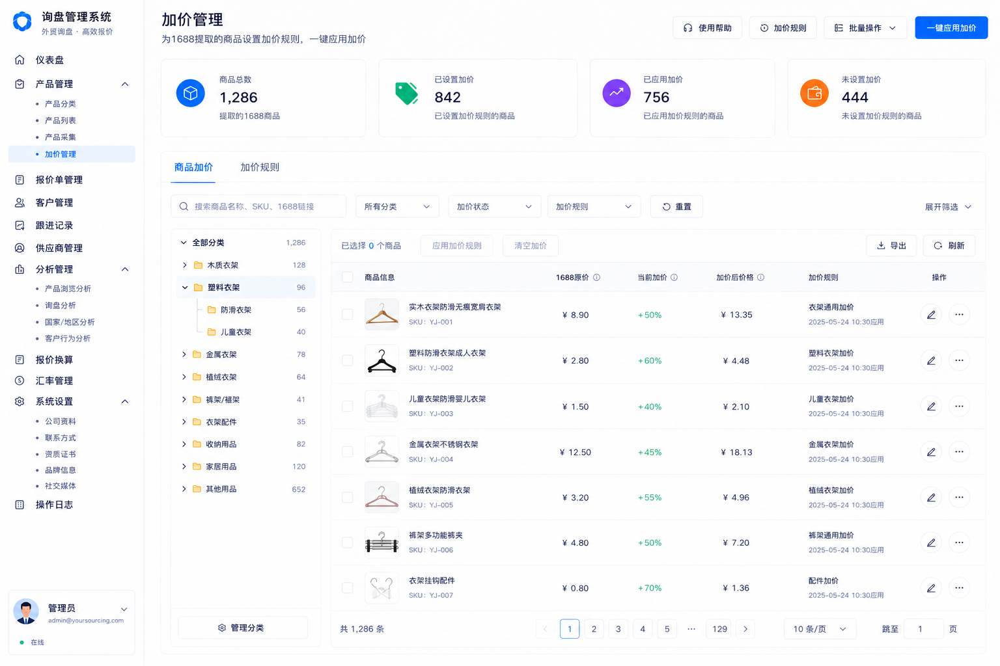

功能说明：

- 维护产品报价加价规则，用于业务报价参考。

MVP 建议：

- 先实现后台规则维护，不强制自动参与前台价格计算。
- 报价单详情中可展示按规则计算出的参考价。

规则类型：

| 类型 | 说明 |
| --- | --- |
| 固定金额加价 | 在基础价格上加固定金额 |
| 百分比加价 | 在基础价格上按比例加价 |
| 阶梯加价 | 按价格区间或数量区间加价，MVP 可预留 |

字段要求：

| 字段 | 必填 | 说明 |
| --- | --- | --- |
| 规则名称 | 是 | 后台识别 |
| 适用范围 | 是 | 全部产品、指定分类、指定产品 |
| 加价类型 | 是 | 固定金额、百分比 |
| 加价值 | 是 | 金额或百分比 |
| 币种 | 否 | MVP 可默认 USD |
| 状态 | 是 | 启用、停用 |

验收标准：

- 可创建、编辑、停用加价规则。
- 同一产品存在多条规则时，MVP 需明确优先级，建议指定产品优先于分类，分类优先于全局。
- 停用规则不参与参考价计算。

### 7.7 报价单管理

参考界面：

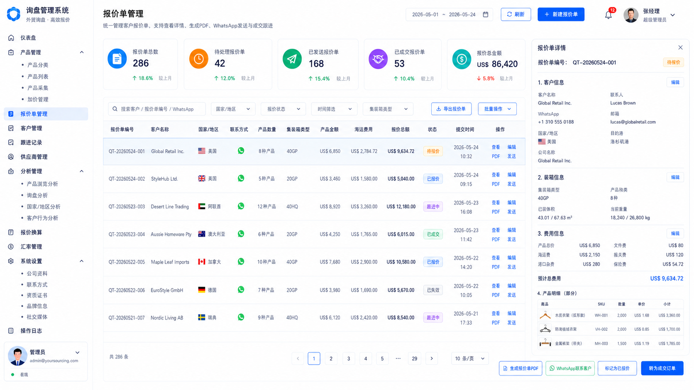

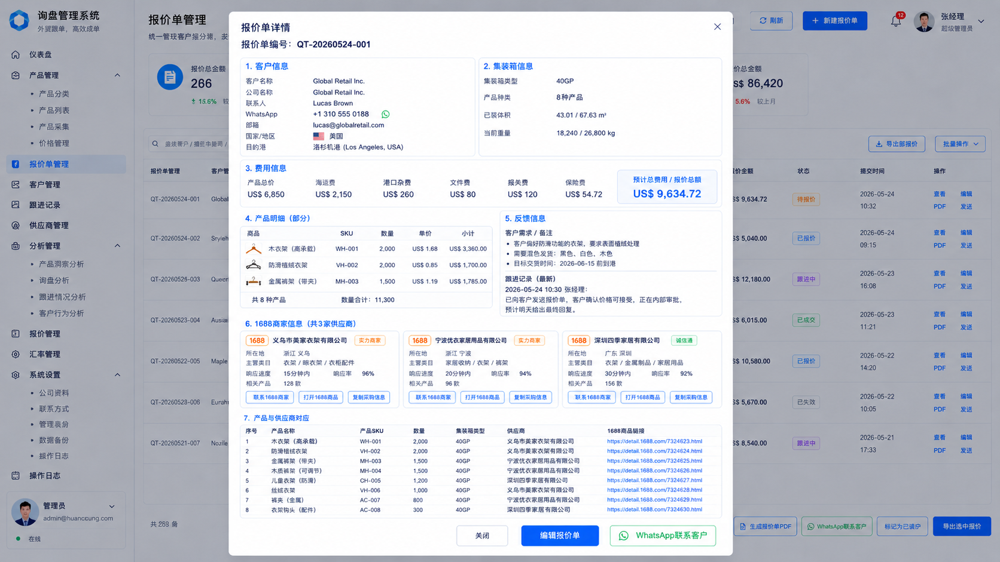

功能说明：

- 接收和管理前台提交的询价单。
- 支持业务人员查看详情、更新状态和记录跟进。
- 支持报价单导出、PDF 生成、WhatsApp 联系客户等快捷动作，MVP 可先实现基础入口或手动状态记录。

报价单状态：

| 状态 | 说明 |
| --- | --- |
| 新询价 | 客户刚提交，尚未处理 |
| 已查看 | 业务员已打开查看 |
| 跟进中 | 已开始联系客户 |
| 已报价 | 已向客户发送报价 |
| 已成交 | 客户确认合作 |
| 已关闭 | 无效、取消或长期未转化 |

列表字段：

| 字段 | 说明 |
| --- | --- |
| 报价单编号 | 系统生成 |
| 客户姓名 | 来自询价表单 |
| 国家或地区 | IP 识别或客户填写 |
| 目的港 | 客户填写 |
| 产品数量 | 询价中产品数量 |
| 集装箱类型 | 如 20GP、40GP、40HQ |
| 产品金额 | 产品明细合计 |
| 海运费用 | 海运报价或人工录入 |
| 报价总额 | 产品金额加费用估算 |
| 状态 | 当前处理状态 |
| 创建时间 | 提交时间 |
| 负责人 | 业务员，MVP 可为空 |

详情字段：

- 客户联系方式
- 产品清单
- 产品规格
- 数量
- 目的国家或地区
- 目的港
- 集装箱或运输信息
- 海运报价结果或客户请求
- 费用信息和报价总额
- 关联 1688 商家信息，MVP 可选
- 客户备注
- 跟进记录
- 状态流转记录

验收标准：

- 前台提交询价后，后台报价单列表实时或刷新后可见。
- 点击查看可进入详情页。
- 业务员可更新报价单状态。
- 报价单详情保留提交时的产品、规格和客户信息快照，避免后续产品修改影响历史报价单。
- 报价单详情可展示客户信息、装箱信息、费用信息、产品明细和跟进信息。

### 7.8 客户管理

参考界面：

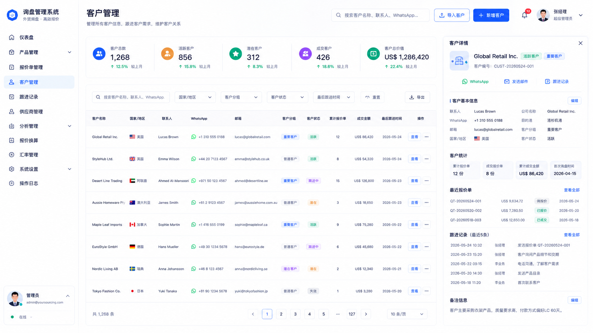

功能说明：

- 管理客户资料，沉淀询价客户和人工录入客户。

功能点：

- 客户列表
- 新增客户
- 编辑客户
- 查看客户详情
- 按国家或地区、来源、创建时间筛选
- 关联报价单
- 关联跟进记录
- 客户详情侧栏，展示基础信息、客户统计、最近报价单、跟进记录和备注
- WhatsApp 和邮件快捷联系

字段要求：

| 字段 | 必填 | 说明 |
| --- | --- | --- |
| 客户姓名 | 是 | 联系人姓名 |
| 邮箱 | 否 | 邮箱和电话至少填写一个 |
| 电话 | 否 | 邮箱和电话至少填写一个 |
| WhatsApp | 否 | 常用外贸联系方式 |
| 公司名 | 否 | 客户公司 |
| 国家或地区 | 否 | IP 识别或人工维护 |
| 来源 | 否 | 前台询价、人工录入等 |
| 客户分组 | 否 | 如重要客户、普通客户、潜在客户 |
| 客户状态 | 否 | 活跃、跟进中、潜在、失效 |
| 备注 | 否 | 内部备注 |

验收标准：

- 询价提交后可自动生成或关联客户。
- 相同邮箱或电话的客户需支持去重提示。
- 客户详情可查看历史报价单和跟进记录。

### 7.9 跟进记录

参考界面：

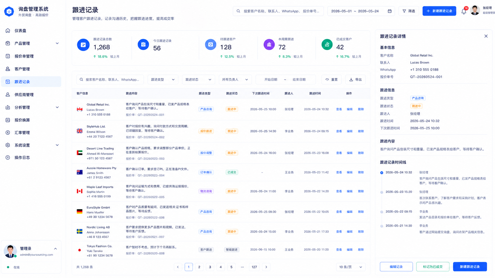

功能说明：

- 记录业务员对客户或报价单的跟进行为。

功能点：

- 新增跟进记录
- 编辑跟进记录
- 删除跟进记录，MVP 可仅管理员允许
- 按客户、报价单、业务员、时间筛选
- 设置下次跟进时间，MVP 可选

字段要求：

| 字段 | 必填 | 说明 |
| --- | --- | --- |
| 关联客户 | 是 | 跟进对象 |
| 关联报价单 | 否 | 可关联具体询价 |
| 跟进方式 | 是 | 邮件、电话、WhatsApp、其他 |
| 跟进内容 | 是 | 文本记录 |
| 下次跟进时间 | 否 | 用于提醒 |
| 跟进人 | 是 | 当前后台用户 |

验收标准：

- 报价单详情和客户详情均可查看相关跟进记录。
- 新增跟进记录后，关联客户的最近跟进时间更新。

### 7.10 供应商管理

参考界面：

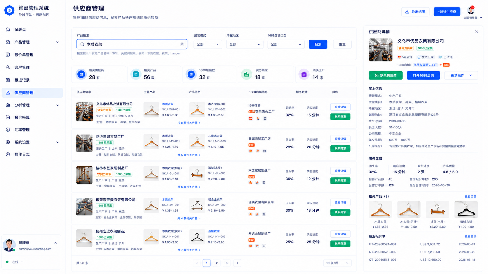

功能说明：

- 维护供应商资料，用于产品来源、采购和报价参考。

功能点：

- 供应商列表
- 新增供应商
- 编辑供应商
- 删除或停用供应商
- 关联产品
- 按产品关键词、地区、经营模式、1688 店铺类型搜索供应商
- 供应商详情侧栏，展示基本信息、服务数据、相关产品和最近报价

字段要求：

| 字段 | 必填 | 说明 |
| --- | --- | --- |
| 供应商名称 | 是 | 公司或店铺名称 |
| 联系人 | 否 | 供应商联系人 |
| 联系方式 | 否 | 手机、电话、微信等 |
| 地址 | 否 | 供应商地址 |
| 1688 链接 | 否 | 二期采集能力可复用 |
| 经营模式 | 否 | 生产厂家、贸易商等 |
| 所在地区 | 否 | 省市或国家地区 |
| 主营类目 | 否 | 供应商主营产品范围 |
| 服务数据 | 否 | 响应速度、回头率、发货速度、产品质量等 |
| 备注 | 否 | 内部备注 |
| 状态 | 是 | 启用、停用 |

验收标准：

- 可维护供应商基础资料。
- 产品可关联供应商。
- 停用供应商不影响历史产品和历史报价单快照。

### 7.11 分析管理

功能说明：

- 分析管理用于判断产品热度、询价转化、客户来源和国家或地区分布，是后续运营和 SaaS 价值展示的关键模块。
- MVP 应优先完成事件埋点和基础统计，不要求一开始实现完整 BI。

MVP 埋点事件：

- 产品浏览事件
- 分类点击事件
- 提交询价事件
- 获取海运报价事件
- 国家或地区识别结果
- 搜索关键词事件
- 产品规格选择事件
- 询价提交失败事件

MVP 基础看板：

| 看板 | 指标 |
| --- | --- |
| 产品浏览分析 | 浏览量、访客数、热门产品 |
| 询盘分析 | 询价总数、今日新增、转化产品排行 |
| 国家或地区分析 | 访客国家或地区、询价国家或地区 |
| 客户行为分析 | 浏览产品数、提交询价路径、最近访问时间 |

数据采集要求：

- 前台关键动作需记录事件名称、时间、产品、分类、会话标识、IP 国家或地区、来源页面。
- MVP 可使用匿名 session 标识客户行为，不强制客户登录。
- 若客户提交询价，应将匿名行为与客户和报价单关联。

二期增强：

- 转化漏斗分析
- 产品热度排行
- 客户画像
- 来源渠道分析
- 租户维度分析
- 自定义报表

验收标准：

- 产品详情页访问可以形成浏览记录。
- 提交询价可以形成询盘统计。
- 后台能查看基础产品浏览和询价统计。
- 同一客户提交询价后，可在客户详情中看到其关键行为摘要。

### 7.12 报价换算

功能说明：

- 报价换算用于帮助业务员快速从产品成本、加价规则、汇率、运费等信息生成参考报价。
- MVP 可先做后台内部使用的报价计算器，不直接向客户承诺最终价格。

MVP 尝试版本：

- 支持产品价格、加价、汇率、运费、税费等综合换算。
- 支持不同币种报价。
- 支持根据产品基础价格和加价规则计算参考价。
- 支持业务员手动输入运费、杂费、折扣、利润率。
- 支持计算结果保存到报价单详情。
- 支持人工修改最终报价。

字段要求：

| 字段 | 必填 | 说明 |
| --- | --- | --- |
| 产品成本价 | 否 | 来自产品或手动输入 |
| 加价规则 | 否 | 可自动匹配或手动选择 |
| 币种 | 是 | 默认 USD |
| 汇率 | 否 | 来自汇率管理或手动输入 |
| 运费 | 否 | 手动输入或海运报价结果 |
| 杂费 | 否 | 包装、报关、服务费等 |
| 利润率 | 否 | 用于参考报价 |
| 最终报价 | 是 | 业务员确认后的报价 |

二期增强：

- 自动匹配汇率、运费、税费和加价规则。
- 支持报价单导出 PDF。
- 支持邮件发送报价。
- 支持报价版本管理。
- 支持客户在线确认报价。

验收标准：

- 业务员可以在报价单详情中进行报价换算。
- 计算结果可保存为报价单的参考价或最终报价。
- 业务员可覆盖自动计算结果。

### 7.13 汇率管理

功能说明：

- 汇率管理为多币种报价和报价换算提供基础数据。
- MVP 建议至少支持手动汇率，自动化更新可放入二期。

MVP 尝试版本：

- 默认报价币种为 USD。
- 支持维护常用币种，如 CNY、USD、EUR、GBP。
- 支持手动维护汇率。
- 支持设置汇率生效日期。
- 报价换算时可读取当前有效汇率。

字段要求：

| 字段 | 必填 | 说明 |
| --- | --- | --- |
| 基准币种 | 是 | 如 CNY |
| 目标币种 | 是 | 如 USD |
| 汇率 | 是 | 手动维护 |
| 生效日期 | 是 | 用于判断当前汇率 |
| 状态 | 是 | 启用、停用 |

二期增强：

- 对接第三方汇率 API。
- 自动定时更新汇率。
- 支持汇率历史记录。
- 支持不同租户配置自己的汇率策略。

验收标准：

- 后台可以手动维护汇率。
- 报价换算可以读取当前启用汇率。
- 停用汇率不参与换算。

### 7.14 多语言与自动翻译

功能说明：

- 前台面向海外客户，多语言能力会直接影响转化。
- MVP 应支持核心内容的多语言字段，自动翻译可先预留入口或做少量尝试。

MVP 尝试版本：

- 前台默认语言为英文。
- 产品分类支持中文后台名和英文展示名。
- 产品支持中文后台名、英文名称、英文描述。
- 系统设置支持英文公司介绍。
- 可为产品预留多语言字段结构。
- 自动翻译入口可先做后台按钮或状态字段，实际翻译可人工完成。

二期增强：

- 接入翻译 API。
- 支持批量翻译产品名称、描述、规格。
- 支持翻译结果人工审核。
- 支持多语言前台路由。
- 支持按客户浏览器语言或国家地区自动推荐语言。

验收标准：

- 前台展示内容不依赖中文字段。
- 后台可以维护英文产品内容。
- 数据结构支持后续新增多语言内容。

### 7.15 在线支付

功能说明：

- 在线支付不是 MVP 询价闭环的必需项，但它决定后续从询价平台升级为交易平台的能力边界。

MVP 尝试版本：

- 报价单支持付款状态字段。
- 支持记录外部付款链接或线下付款备注。
- 支持上传付款凭证，MVP 可选。

付款状态：

| 状态 | 说明 |
| --- | --- |
| 未付款 | 尚未产生付款 |
| 待确认 | 客户已付款或上传凭证，待业务确认 |
| 已付款 | 后台确认收到款项 |
| 已取消 | 付款取消或失效 |

二期增强：

- 对接 Stripe、PayPal 等支付渠道。
- 支持客户在线支付。
- 支持支付回调。
- 支持退款、部分付款和账单管理。

验收标准：

- 后台可在报价单中维护付款状态。
- 付款信息不影响询价主流程。
- 数据结构支持后续接入支付流水。

### 7.16 客户前台账号体系

功能说明：

- MVP 阶段前台不强制客户注册，降低询价门槛。
- 但系统应预留客户身份识别能力，方便后续客户登录、询价历史和交易闭环。

MVP 尝试版本：

- 客户无需登录即可提交询价。
- 通过邮箱、电话、WhatsApp、匿名 session 识别客户。
- 后台客户管理保留客户来源和最近访问行为。
- 可预留客户账号表或账号字段，但不作为 MVP 强依赖。

二期增强：

- 客户注册和登录。
- 客户查看询价历史。
- 客户收藏产品。
- 客户确认报价。
- 客户查看订单和付款记录。

验收标准：

- 未登录客户可以完成询价。
- 同一邮箱或电话提交询价时，后台可以提示关联已有客户。
- 行为数据可在提交询价后关联到客户。

### 7.17 邮件、WhatsApp 与 CRM 集成

功能说明：

- 外贸跟进高度依赖邮件、WhatsApp 和 CRM。MVP 应先完成基础通知和快捷触达，后续再做深度自动化。

MVP 尝试版本：

- 客户提交询价后，系统发送后台通知邮件，MVP 可先通知固定内部邮箱。
- 报价单详情展示客户邮箱、电话、WhatsApp。
- 支持点击客户邮箱打开邮件客户端。
- 支持点击 WhatsApp 号码跳转 WhatsApp 联系链接。
- 跟进记录支持记录邮件、电话、WhatsApp、CRM 等跟进方式。
- CRM 集成先预留来源字段、外部客户 ID、同步状态。

二期增强：

- 邮件模板和自动发送。
- 询价成功自动给客户发送确认邮件。
- WhatsApp Business API 集成。
- CRM 双向同步。
- 自动创建销售线索。
- 跟进任务和提醒。

验收标准：

- 新询价可以通知内部人员。
- 业务员可以从报价单详情快捷联系客户。
- 跟进记录可以标记触达渠道。
- 客户和报价单数据结构支持外部 CRM ID。

### 7.18 系统设置

功能说明：

- 管理前台站点展示的企业信息。

模块：

- 公司资料
- 联系方式
- 资质证书
- 品牌信息
- 社交媒体

字段要求：

| 模块 | 字段 |
| --- | --- |
| 公司资料 | 公司名称、英文名称、公司介绍、地址 |
| 联系方式 | 邮箱、电话、WhatsApp、联系人 |
| 资质证书 | 证书名称、证书图片、排序、状态 |
| 品牌信息 | Logo、品牌名、网站标题、网站描述 |
| 社交媒体 | Facebook、LinkedIn、YouTube、Instagram、TikTok 等链接 |

验收标准：

- 修改系统设置后，前台对应位置可展示最新内容。
- 图片上传格式和大小需有限制。

## 8. 前台功能需求

### 8.1 首页

参考界面：

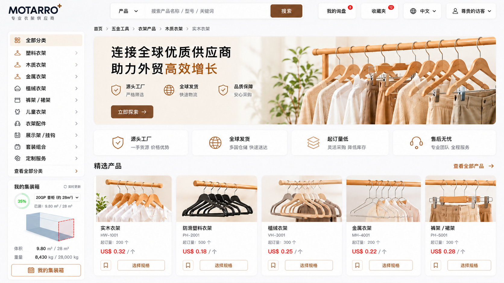

功能说明：

- 面向海外客户展示品牌、核心产品和入口。

MVP 内容：

- 顶部导航
- Logo 和品牌信息
- 产品分类入口
- 推荐产品或最新产品
- 查看全部产品入口
- 联系方式或提交询价入口
- 社交媒体链接
- 左侧分类导航，MVP 可在桌面端展示
- 集装箱概览入口，MVP 可作为询价辅助组件

验收标准：

- 客户可从首页进入全部产品列表。
- 首页展示的产品必须来自后台已上架产品。

### 8.2 全部产品列表

参考界面：

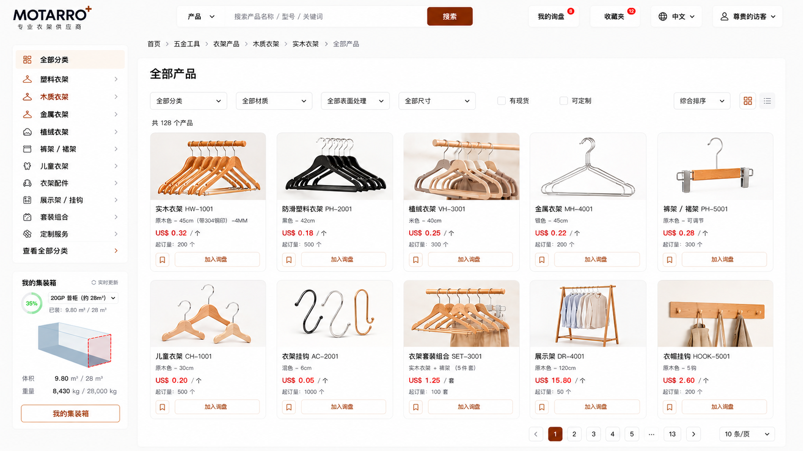

功能说明：

- 展示所有上架产品，支持客户浏览和进入详情。

功能点：

- 产品卡片
- 分类筛选
- 关键词搜索
- 分页或加载更多
- 排序，MVP 可按后台排序和创建时间
- 网格和列表视图切换，MVP 可选
- 收藏或加入询价按钮，MVP 可选收藏，必须支持加入询价

验收标准：

- 仅展示上架产品。
- 点击产品可进入产品详情页。
- 分类筛选结果正确。

### 8.3 产品分类页

参考界面：

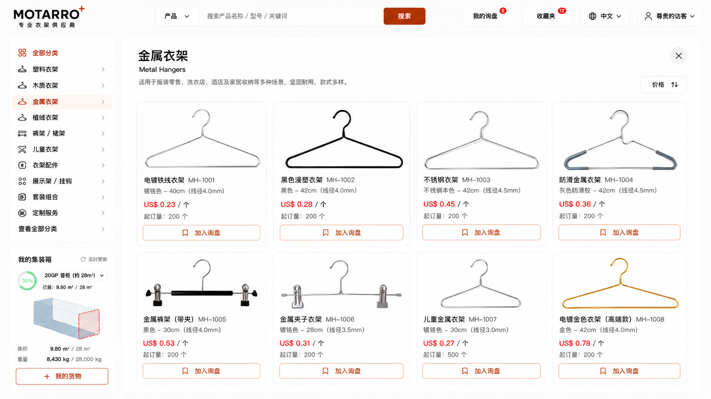

功能说明：

- 客户点击产品分类后，查看该分类下产品。

验收标准：

- 分类页展示分类名称、描述和产品列表。
- 停用分类不可访问或不展示产品。

### 8.4 产品详情与规格选择

参考界面：

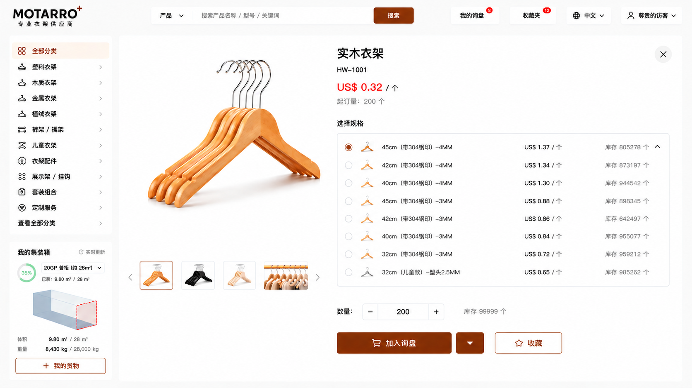

功能说明：

- 展示产品详细信息，并允许客户选择规格和数量。

功能点：

- 产品主图和相册
- 产品英文名称
- 产品描述
- 规格选择
- 数量输入
- MOQ 提示
- 加入询价或下一步询价
- 展示规格价格、库存、MOQ 和可选图片
- 支持在规格弹窗或详情页内调整数量

验收标准：

- 客户必须选择必要规格后才能进入询价流程。
- 数量低于 MOQ 时需提示。
- 选择规格后，询价单中记录规格快照。

### 8.5 集装箱与海运报价

参考界面：

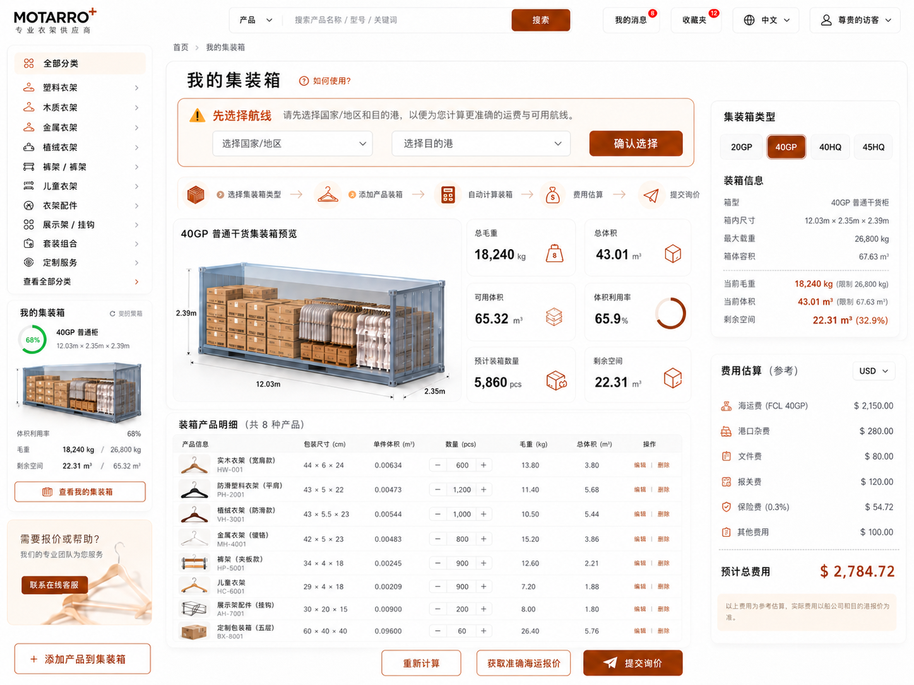

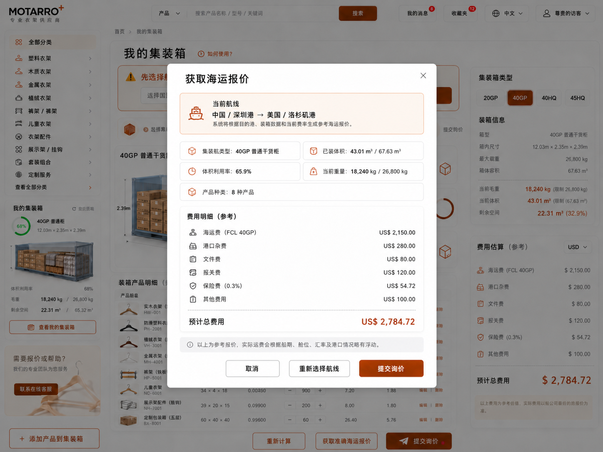

功能说明：

- 客户填写运输目的地，系统辅助生成海运报价或报价请求。
- 系统根据客户已选产品估算装箱体积、重量、空间利用率和参考费用。

功能点：

- 自动识别客户 IP 对应国家或地区。
- 默认填充国家或地区。
- 客户可手动修改国家或地区。
- 客户填写目的港。
- 客户选择集装箱类型或运输方式，MVP 可简化。
- 点击获取海运报价。
- 展示装箱产品明细、总体积、总重量、可用体积、体积利用率和预计费用。
- 支持重新计算、重新选择航线和提交询价。

字段要求：

| 字段 | 必填 | 说明 |
| --- | --- | --- |
| 国家或地区 | 是 | IP 自动识别，允许修改 |
| 目的港 | 是 | 客户填写 |
| 集装箱类型 | 否 | 如 20GP、40GP、40HQ，MVP 可选 |
| 产品装箱明细 | 是 | 产品、规格、数量、单件体积、总重量等 |
| 费用估算 | 否 | 海运费、港口杂费、文件费、报关费、保险费等 |
| 备注 | 否 | 特殊运输要求 |

验收标准：

- IP 识别失败时，客户可手动选择国家或地区。
- 未填写目的港时不能获取海运报价。
- MVP 如无真实海运 API，可展示“已收到海运报价请求”或后台人工报价提示。
- 装箱计算结果需随询价一起提交到后台报价单。

### 8.6 提交询价

参考界面：

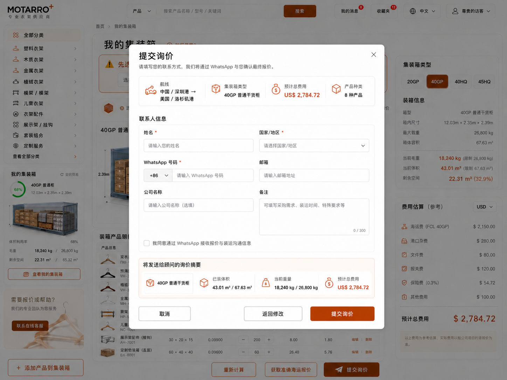

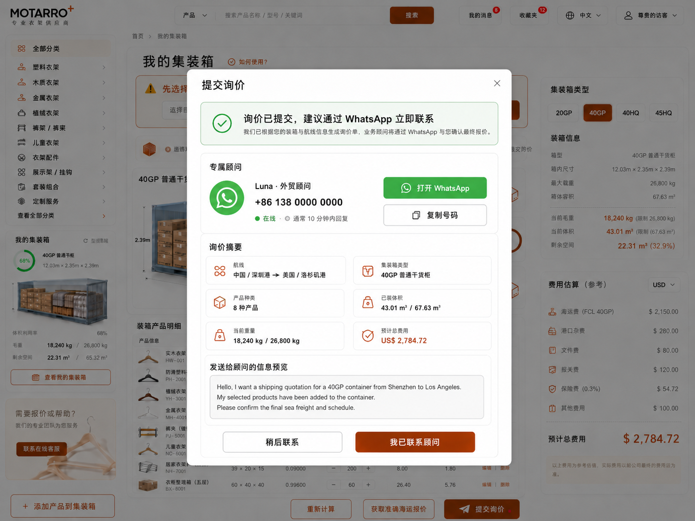

功能说明：

- 客户填写联系方式，提交完整询价信息。
- 提交成功后优先引导客户通过 WhatsApp 与业务顾问继续沟通。

字段要求：

| 字段 | 必填 | 说明 |
| --- | --- | --- |
| 姓名 | 是 | 联系人 |
| 邮箱 | 否 | 邮箱和电话至少一个必填 |
| 电话 | 否 | 邮箱和电话至少一个必填 |
| WhatsApp | 否 | 推荐字段 |
| 公司名 | 否 | 客户公司 |
| 国家或地区 | 是 | IP 自动识别或客户填写 |
| 目的港 | 是 | 运输目的港 |
| 备注 | 否 | 客户补充说明 |

验收标准：

- 提交成功后生成后台报价单。
- 提交成功后给客户展示成功反馈。
- 系统需防止重复提交，至少通过按钮 loading 和短时间重复提交限制实现。
- 提交成功页需展示询价摘要和 WhatsApp 快捷联系入口，MVP 可使用跳转链接。

## 9. 数据需求

### 9.1 核心实体

| 实体 | 说明 |
| --- | --- |
| User | 后台用户 |
| ProductCategory | 产品分类 |
| Product | 产品 |
| ProductSpec | 产品规格 |
| Supplier | 供应商 |
| MarkupRule | 加价规则 |
| Quote | 报价单或询价单 |
| QuoteItem | 报价单产品明细 |
| Customer | 客户 |
| FollowUpRecord | 跟进记录 |
| CompanySetting | 公司和品牌配置 |
| Certificate | 资质证书 |
| SocialLink | 社交媒体链接 |
| ImportBatch | 离线导入批次 |
| ProductSource | 产品源记录，如 1688 链接、来源文件、来源页面 |
| ProductDraft | 采集后生成的产品草稿 |
| ImportParseLog | 离线导入解析日志和异常记录 |
| AnalyticsEvent | 前台行为埋点事件 |
| ExchangeRate | 汇率 |
| QuoteCalculation | 报价换算记录 |
| PaymentRecord | 付款记录或付款状态 |
| CustomerIdentity | 客户邮箱、电话、WhatsApp、匿名 session 等身份标识 |
| IntegrationRecord | 邮件、WhatsApp、CRM 等外部集成记录 |

### 9.2 SaaS 阶段新增实体

| 实体 | 说明 |
| --- | --- |
| Tenant | 租户 |
| TenantMember | 租户成员 |
| Role | 角色 |
| Permission | 权限 |
| Plan | 套餐 |
| Subscription | 订阅 |
| AuditLog | 审计日志 |
| TenantDomain | 租户域名 |

### 9.3 历史快照要求

报价单必须保存提交时的产品和客户关键信息快照，包括：

- 产品名称
- 产品图片
- 规格
- 数量
- 基础价格或参考价
- 客户联系方式
- 国家或地区
- 目的港
- 运输信息

原因：产品、价格、客户资料后续可能被修改，但历史报价单需要保持当时提交信息不变。

## 10. 权限需求

### 10.1 MVP 权限

MVP 可采用简化权限：

| 角色 | 权限 |
| --- | --- |
| 管理员 | 所有后台功能 |
| 业务员 | 报价单、客户、跟进记录、供应商查看和维护 |
| 产品运营 | 产品分类、产品列表、加价规则、供应商维护 |

如开发成本需要压缩，MVP 第一版可先只有管理员账号，但数据库和代码结构建议预留用户角色字段。

### 10.2 SaaS 权限

SaaS 阶段需支持：

- 租户级数据隔离
- 角色权限配置
- 成员邀请
- 操作审计
- 超级管理员跨租户管理

## 11. 非功能需求

### 11.1 性能

MVP：

- 后台列表页响应时间建议小于 1 秒。
- 前台页面首屏尽量控制在 3 秒内。
- 产品列表、报价单列表、客户列表必须分页。

SaaS：

- 支持租户级横向扩展。
- 支持缓存热点数据。
- 支持队列处理邮件、采集、分析等异步任务。

### 11.2 安全

- 后台接口必须鉴权。
- 密码必须加密存储。
- 表单需做前后端双重校验。
- 防止 SQL 注入、XSS、CSRF 等常见风险。
- 图片上传需限制格式和大小。
- SaaS 阶段需强化租户数据隔离。

### 11.3 可维护性

- 前后台业务模块边界清晰。
- 数据模型需为多租户预留 tenant_id 或可迁移方案。
- 前台展示与后台管理解耦。
- 报价单使用快照字段，避免历史数据被关联数据变更污染。

### 11.4 兼容性

- 前台适配桌面端和移动端。
- 后台优先适配桌面端，平板可用，移动端可不重点优化。
- 支持主流现代浏览器。

## 12. 技术选型建议

### 12.1 MVP 技术选型原则

- 最快速上线。
- 包含完整业务闭环。
- 开发和部署成本低。
- 代码结构为后续扩展和迁移保留空间。
- 避免过早引入复杂微服务。

### 12.2 MVP 推荐方案

推荐方案：单体全栈应用。

| 层级 | 建议 |
| --- | --- |
| 前端和后台 | Next.js 或类似全栈框架 |
| UI | Ant Design、shadcn/ui 或成熟后台模板 |
| 数据库 | PostgreSQL |
| ORM | Prisma 或 Drizzle |
| 鉴权 | Auth.js、Lucia 或自研轻量 session |
| 文件存储 | 本地对象存储兼容方案，或直接使用 S3/R2/OSS |
| 部署 | VPS、Docker Compose、Vercel + 托管数据库均可 |
| IP 识别 | 第三方 GeoIP API 或本地 GeoIP 库 |

说明：

- 如果团队前端能力较强，Next.js 可以同时承载前台、后台和 API，最快完成 MVP。
- 如果后台复杂度明显增长，可后续拆出独立 API 服务。
- 数据库优先使用 PostgreSQL，方便后续做多租户、搜索、报表和事务处理。

### 12.3 SaaS 企业级阶段建议

| 层级 | 建议 |
| --- | --- |
| 前台 | Next.js，支持租户域名和 SEO |
| 后台 | Next.js 或独立 React Admin |
| API | NestJS、Fastify、Go 或 Java Spring Boot |
| 数据库 | PostgreSQL，按 tenant_id 数据隔离，必要时演进到独立库 |
| 缓存 | Redis |
| 队列 | BullMQ、RabbitMQ、SQS 等 |
| 搜索 | PostgreSQL Full Text、Meilisearch 或 Elasticsearch |
| 文件存储 | S3、Cloudflare R2、阿里云 OSS |
| 监控 | Sentry、OpenTelemetry、Prometheus、Grafana |
| 部署 | Docker、Kubernetes 或云平台托管服务 |

多租户策略建议：

- 初期 SaaS：共享数据库、共享表、tenant_id 隔离。
- 中期增长：大租户可迁移到独立 schema 或独立数据库。
- 所有业务表从设计上预留 tenant_id，MVP 即使单租户也建议保留或确保后续可平滑补充。

## 13. MVP 里程碑

### 13.1 M1：基础后台

- 登录
- 产品分类
- 产品列表
- 供应商管理
- 离线导入批次管理
- 1688 源记录和来源文件追溯
- 系统设置

交付结果：

- 内部可以维护前台展示所需的基础数据，并能记录产品来源和离线导入批次。

### 13.2 M2：前台产品与询价

- 首页
- 全部产品
- 分类页
- 产品详情
- 规格选择
- 海运信息填写
- 提交询价
- 匿名行为埋点
- 国家或地区识别记录

交付结果：

- 客户可以从浏览产品到提交询价完成完整流程，系统可以记录关键行为数据。

### 13.3 M3：报价和客户闭环

- 报价单管理
- 报价单详情
- 客户管理
- 跟进记录
- 加价管理
- 报价换算最小版本
- 手动汇率管理
- 邮件通知和 WhatsApp 快捷联系
- 仪表盘

交付结果：

- 内部业务可以处理询价、沉淀客户、记录跟进，并完成内部参考报价。

### 13.4 M4：差异化能力试点

- 离线导出包解析
- 采集源生成产品草稿
- 产品草稿人工确认入库
- 基础分析看板
- 多语言字段维护
- 付款状态记录
- 客户身份识别和去重提示
- CRM 集成字段预留

交付结果：

- MVP 不只完成询价闭环，还能验证采集、分析、报价、多语言和触达这些差异化方向。

### 13.5 M5：上线准备

- 表单校验
- 权限加固
- 图片上传限制
- 基础性能优化
- 数据备份
- 部署脚本
- 测试和问题修复

交付结果：

- MVP 可供内部真实业务使用。

## 14. MVP 验收标准

### 14.1 前台验收

- 客户可以打开首页。
- 客户可以查看全部产品。
- 客户可以按分类查看产品。
- 客户可以进入产品详情。
- 客户可以选择规格和数量。
- 系统可以自动识别客户国家或地区，失败时允许手动填写。
- 客户可以填写目的港。
- 客户可以提交询价。
- 提交成功后展示成功反馈。

### 14.2 后台验收

- 管理员可以登录后台。
- 后台可以维护产品分类。
- 后台可以维护产品列表和上下架状态。
- 后台可以上传或选择离线导出包，并生成导入批次。
- 后台可以解析样例包中的 JSON、Excel、HTML 和图片资源。
- 后台可以根据解析结果生成产品草稿或关联正式产品。
- 后台可以维护供应商。
- 后台可以维护加价规则。
- 后台可以查看前台提交的报价单。
- 后台可以查看报价单详情。
- 后台可以在报价单中进行报价换算并保存结果。
- 后台可以维护手动汇率。
- 后台可以查看基础产品浏览和询价统计。
- 后台可以维护客户资料。
- 后台可以添加跟进记录。
- 后台可以通过邮件地址或 WhatsApp 快捷联系客户。
- 后台可以维护报价单付款状态。
- 后台可以维护公司资料、联系方式、资质证书、品牌信息和社交媒体。

### 14.3 数据验收

- 前台仅展示上架产品。
- 询价单必须保存产品、规格、客户、目的港等快照信息。
- 报价单、客户、跟进记录之间可以正确关联。
- 删除或下架产品不影响历史报价单查看。
- 离线导入批次、采集源、来源文件、产品草稿和正式产品之间可以追溯。
- 前台行为事件可以在客户提交询价后关联到客户或报价单。
- 报价换算记录、汇率、付款状态需保留历史，不应被后续配置变更覆盖。

## 15. 风险与决策点

| 风险或决策点 | 建议 |
| --- | --- |
| 海运报价是否接真实 API | MVP 可先做人工报价或占位结果，避免对接成本拖慢上线 |
| 实时爬虫风险 | MVP 不做系统实时爬取，采用人工下载离线包后再导入解析 |
| 离线包格式不稳定 | MVP 先支持样例包中的 JSON、Excel、HTML 和图片目录，再逐步扩展格式 |
| 产品采集复杂度 | MVP 先做离线包解析、草稿和人工确认；二期提升离线处理自动化；长期探索全自动采集与注入 |
| 全自动采集合规不确定性 | 全自动是长期目标，不作为 MVP 承诺；进入开发前需评估目标网站规则、授权方式、访问频率、数据使用边界和法律风险 |
| 全自动采集技术稳定性 | 需验证页面结构变化、反自动化策略、图片质量、SKU 解析准确率和异常恢复能力 |
| 分析管理数据不足 | MVP 先埋点并做基础统计，避免一开始建设复杂 BI |
| 自动翻译准确性 | MVP 先允许人工维护英文内容，自动翻译必须人工审核后发布 |
| 在线支付合规和回调复杂度 | MVP 先记录付款状态和外部付款信息，真实支付二期接入 |
| 是否第一版就做多租户 | MVP 内部使用不建议完整实现，但建议数据模型预留 |
| 是否做客户账号体系 | MVP 不强制注册，但保留客户身份识别和询价历史的数据基础 |
| 报价是否自动计算 | MVP 可做参考价和人工确认，不强制自动出正式报价 |
| WhatsApp 和 CRM 接口限制 | MVP 先做快捷跳转和字段预留，API 集成二期推进 |
| 后台权限复杂度 | MVP 可简化为管理员，预留角色字段 |

## 16. 后续需求池

- 批量离线包导入
- 已下载文件自动解析和商品清洗
- 合规接口化采集评估
- 全自动采集与产品注入探索
- 授权数据源或 API 接入
- 页面结构变化自动识别
- 1688 多源比价
- 多语言前台路由
- 自动翻译和人工审核流
- 海运报价 API 对接
- 报价单 PDF 导出
- 邮件报价发送
- 邮件模板和自动触达
- WhatsApp Business API 集成
- CRM 双向同步
- 客户行为分析增强
- 产品热度分析增强
- 询盘转化漏斗
- 自动汇率 API
- 多币种报价
- 在线支付
- 客户前台账号和询价历史
- SaaS 多租户
- 套餐计费
- 租户自定义域名
- 平台超级后台
